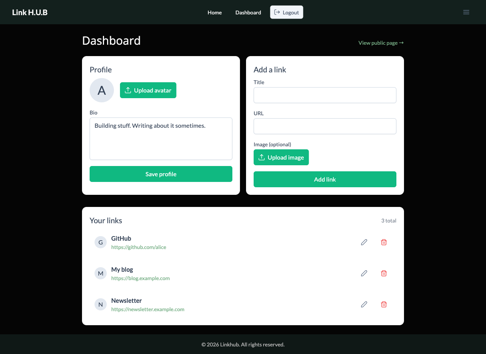
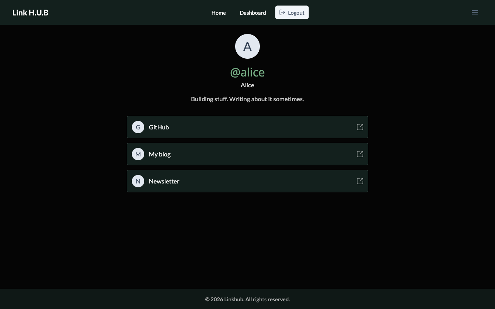
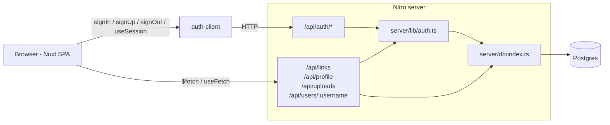

# Linkhub

> Your single shareable profile URL — sign up, paste your links, share once.


A small "Linktree"-style app: signed-in users curate a public profile page that lists links to
their content. Built on Nuxt 3 with TypeScript end-to-end, PrimeVue 4 components, Tailwind 4,
Drizzle ORM over Postgres, and better-auth for sessions.

---

## Features

- **One profile, many links.** Add unlimited links — titles, URLs, optional per-link images.
- **A page that's yours.** Pick a username at sign-up; your public profile lives at
  `/your-username`. Update your avatar and bio from the dashboard.
- **Edit anything anytime.** Click ✎ to rename or rewire a link, click 🗑 (with a confirm
  dialog) to remove it. Changes appear on your public page immediately.
- **Real auth.** Email + password sessions backed by httpOnly cookies. Protected routes redirect
  to `/login?redirect=...`; signed-in visitors to `/login` are bounced back to `/dashboard`.
- **SEO-friendly public pages.** `/your-username` is server-rendered, returning a proper 404 for
  unknown slugs.
- **Self-hostable.** Postgres in Docker, the Nuxt app does the rest. No external services
  required for development.

## How it looks

### Dashboard
Edit your profile and curate links from one screen.



### Public profile
What visitors see at `/your-username`.



## Architecture



For the deeper version see [`docs/architecture.md`](docs/architecture.md). Auth flow lives in
[`docs/auth-flow.md`](docs/auth-flow.md), schema in [`docs/data-model.md`](docs/data-model.md),
and full first-run instructions in [`docs/dev-setup.md`](docs/dev-setup.md).

## Stack

| Layer | Tech |
|---|---|
| Framework | Nuxt 3 (latest 3.x patch) |
| Language | TypeScript |
| State | Pinia (`useLinksStore`) |
| UI | PrimeVue 4 + Aura preset |
| Utility CSS | Tailwind 4 + `tailwindcss-primeui` |
| Icons | PrimeIcons |
| Backend | Nitro server routes |
| ORM | Drizzle (`drizzle-orm/node-postgres`) |
| Database | Postgres 16 (Docker locally) |
| Auth | better-auth (email + password) + drizzle adapter |
| Tests | Vitest + happy-dom |
| Tooling | ESLint flat config, Prettier |

## First-time setup

1. Install dependencies.
   ```bash
   npm install
   ```
2. Copy the env template and (re)generate a secret.
   ```bash
   cp .env.example .env
   # Replace BETTER_AUTH_SECRET with a strong random value
   #   openssl rand -base64 32
   ```
3. Bring up Postgres via Docker.
   ```bash
   docker compose up -d
   ```
4. Apply migrations.
   ```bash
   npm run db:migrate
   ```

## Running

```bash
npm run dev          # Nuxt dev server on http://localhost:3000
npm run build        # production build
npm run preview      # serve the production build locally
```

## Database (Drizzle)

```bash
npm run db:generate  # diff schema -> emit a new SQL migration
npm run db:migrate   # apply pending migrations
npm run db:studio    # browse/edit data in Drizzle Studio
```

Migration SQL lives in `server/db/migrations/` and is committed.

## Tests, lint, and typecheck

```bash
npm test             # vitest run (unit)
npm run lint         # eslint .
npm run lint:fix     # eslint . --fix
npm run format       # prettier --write .
npm run typecheck    # nuxt typecheck (vue-tsc)
```

## Project layout

```
linkhub/
├─ assets/css/              # global Tailwind entry + brand overrides
├─ components/              # AppHeader, AppFooter
├─ composables/useUploads.ts
├─ docs/                    # architecture, auth-flow, data-model, dev-setup
├─ layouts/default.vue
├─ lib/auth-client.ts       # better-auth Vue client
├─ middleware/{auth,guest}.ts
├─ pages/                   # index, login, register, dashboard, [username], logout
├─ public/uploads/          # user-uploaded files (gitignored except .gitkeep)
├─ server/
│  ├─ api/                  # Nitro routes
│  ├─ db/                   # schema.ts, index.ts, migrations/
│  └─ lib/                  # auth.ts, session.ts
├─ stores/links.ts          # Pinia
├─ tests/                   # vitest
├─ types/                   # models.ts, validation.ts
├─ docker-compose.yml       # Postgres 16
├─ drizzle.config.ts
├─ nuxt.config.ts
├─ eslint.config.mjs        # flat config
├─ vitest.config.ts
└─ .env.example
```
