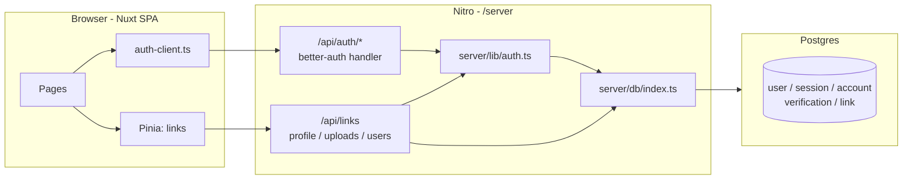

# Linkhub — Architecture Overview

Linkhub is a small "Linktree" clone: signed-in users curate a public profile page that lists links to their other content. This document is the single source of truth for how the system is wired. Detail-level docs are linked at the bottom.

## Stack

| Layer | Tech |
|---|---|
| Frontend | Nuxt 3 (SPA, `ssr: false`) + TypeScript + Pinia |
| UI components | PrimeVue 4 (`@primevue/nuxt-module`, Aura preset) |
| Utility CSS | Tailwind via `@nuxtjs/tailwindcss` |
| Icons | `primeicons` |
| Backend | Nuxt's bundled Nitro server (`/server/api`) |
| ORM | Drizzle (`drizzle-orm/node-postgres`) + `drizzle-kit` |
| Database | Postgres 16 (Docker Compose locally) |
| Auth | better-auth + `@better-auth/drizzle-adapter` (email + password sessions) |
| Tooling | ESLint flat config, Prettier, Vitest |

The backend lives inside the Nuxt app — there is no separate service. `npm run dev` boots both client and server.

## High-level flow



## Authentication

- better-auth manages sessions via httpOnly cookies. The Nitro handler at `/server/api/auth/[...all].ts` forwards all `/api/auth/*` requests into better-auth.
- The Vue client is created in `lib/auth-client.ts` (`createAuthClient()` from `better-auth/vue`). Components import the reactive `useSession`, `signIn`, `signUp`, and `signOut` from it.
- Route protection lives in two middlewares:
  - `middleware/auth.ts` — redirects to `/login?redirect=...` when no session.
  - `middleware/guest.ts` — redirects to `/dashboard` when the session is already valid (used on `login`/`register`).
- See [auth-flow.md](./auth-flow.md) for sequence diagrams.

## Data model

better-auth generates and owns the `user`, `session`, `account`, and `verification` tables. We extend `user` with three custom columns:

- `username` (unique slug, used for the public `/[username]` page)
- `bio` (text)
- `avatarUrl` (text)

We add one application table:

- `link` — `id`, `userId` (fk → user.id), `title`, `url`, `imageUrl`, `position`, `createdAt`, `updatedAt`.

See [data-model.md](./data-model.md) for the full ER diagram.

## File uploads

Multipart uploads land at `POST /api/uploads`. Files are written to `/public/uploads/{uuid}.{ext}` so they're served as static assets. Production object-storage is **out of scope** for this rewrite — see the TODO in [dev-setup.md](./dev-setup.md).

## Project layout

```
linkhub/
├─ app.vue
├─ assets/css/         # global Tailwind entry + brand overrides
├─ components/         # AppHeader, AppFooter, …
├─ composables/        # useUploads
├─ docs/               # this directory
├─ layouts/
├─ lib/auth-client.ts  # better-auth Vue client
├─ middleware/         # auth, guest
├─ pages/              # index, login, register, dashboard, [username], logout
├─ public/uploads/     # served files
├─ server/
│  ├─ api/             # Nitro routes
│  ├─ db/              # schema, drizzle client, migrations/
│  └─ lib/auth.ts      # betterAuth() config
├─ stores/             # Pinia (links)
├─ tests/              # Vitest
├─ types/models.ts
├─ docker-compose.yml
├─ drizzle.config.ts
├─ tailwind.config.js
├─ nuxt.config.ts
├─ eslint.config.mjs
├─ vitest.config.ts
└─ package.json
```

## Further reading

- [auth-flow.md](./auth-flow.md) — sign-up/sign-in/session sequence diagrams.
- [data-model.md](./data-model.md) — schema and constraints.
- [dev-setup.md](./dev-setup.md) — first-run instructions.
