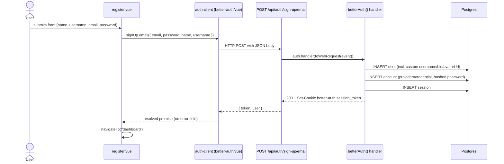
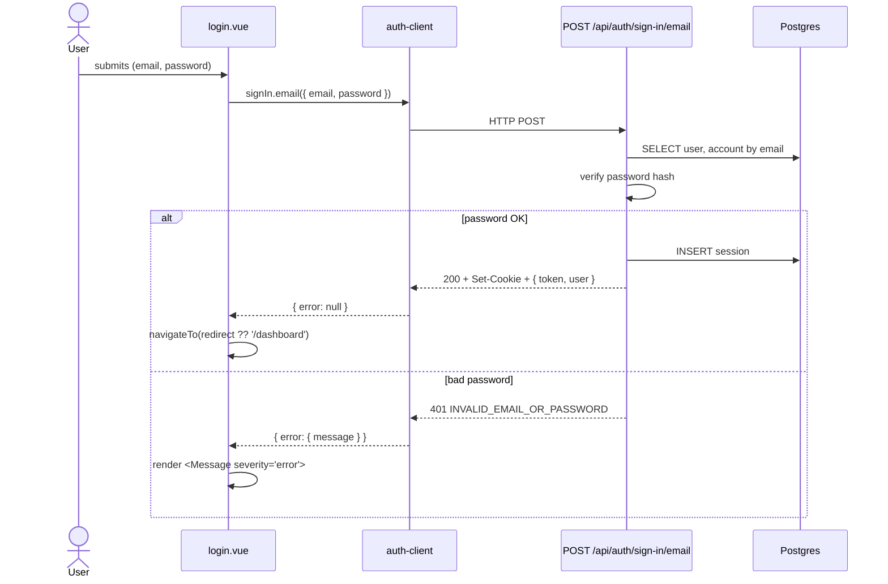
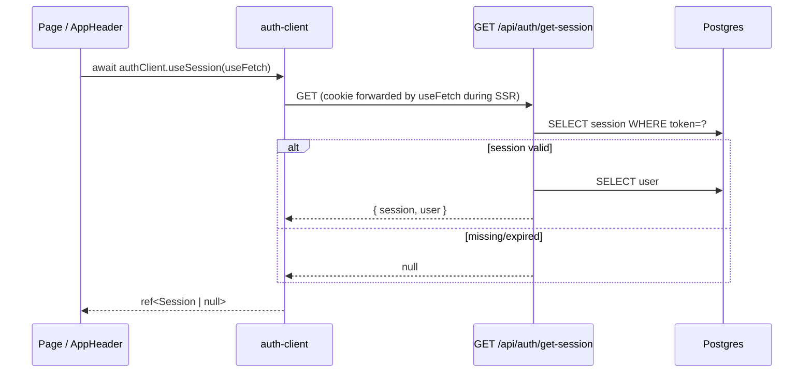
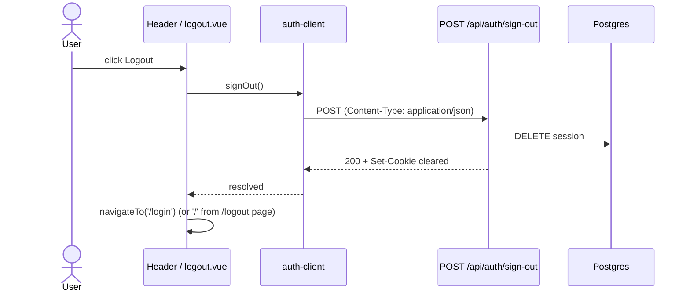

# Authentication Flow

Linkhub uses [better-auth](https://better-auth.com) with email + password and an httpOnly session
cookie. The Vue client lives at `lib/auth-client.ts`; the server-side configuration is at
`server/lib/auth.ts`; every `/api/auth/*` request flows through the catch-all handler at
`server/api/auth/[...all].ts`.

## Sign-up



The `username` field flows through better-auth as an `additionalFields` entry (server-side, in
`server/lib/auth.ts`). `bio` and `avatarUrl` are configured `input: false` so a malicious client
can't set them on signup; they're managed via the profile endpoints.

## Sign-in



## Session check (every page load)



## Route protection

`middleware/auth.ts` runs on every navigation to a `definePageMeta({ middleware: 'auth' })` page
(currently `/dashboard`):

```ts
const { data: session } = await authClient.useSession(useFetch)
if (!session.value) {
  return navigateTo({ path: '/login', query: { redirect: to.fullPath } })
}
```

`middleware/guest.ts` is the inverse — applied to `/login` and `/register` so a signed-in user
gets bounced to `/dashboard` instead of seeing the auth forms again.

## Sign-out



## Authenticated API requests

Server routes that require auth go through `requireUser(event)` from `server/lib/session.ts`:

```ts
const me = await requireUser(event)
// throws createError({ statusCode: 401 }) if no session
```

`requireUser` calls `auth.api.getSession({ headers: event.headers })` — the standard better-auth
helper for reading the session out of an h3 event. There's no second copy of cookie/JWT logic
anywhere in the codebase.
