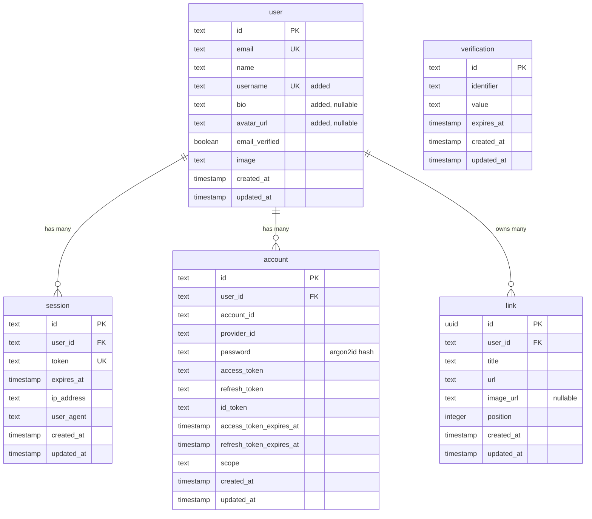

# Data Model

Linkhub stores everything in Postgres via Drizzle ORM. The schema lives in a single file:
[`server/db/schema.ts`](../server/db/schema.ts). Migrations are generated by `drizzle-kit` and
committed under `server/db/migrations/`.

## Entity-relationship diagram



## Tables

### `user`

The auth library owns this table, but we layer three application columns on top:

- **`username`** (text, NOT NULL, UNIQUE) — the slug for the public profile URL `/{username}`.
  Validated against `^[a-z0-9_-]{2,32}$` in [`types/validation.ts`](../types/validation.ts).
- **`bio`** (text, nullable) — free-form profile blurb shown on the public page.
- **`avatar_url`** (text, nullable) — relative path under `/uploads/` (or any URL the user pastes
  in via the profile API).

better-auth is told about the custom fields via `user.additionalFields` in
[`server/lib/auth.ts`](../server/lib/auth.ts). `username` is `input: true` so it's accepted on
sign-up; `bio` and `avatar_url` are `input: false` so they can only be written by the
authenticated profile API.

### `session`, `account`, `verification`

Owned end-to-end by better-auth — schema mirrors what better-auth's CLI would generate. Sessions
cascade-delete when a user is removed.

### `link`

The application's only domain table.

| Column | Type | Notes |
|---|---|---|
| `id` | uuid | Generated server-side via `defaultRandom()`. |
| `user_id` | text (FK → `user.id`) | `ON DELETE CASCADE`. Indexed (`link_user_id_idx`). |
| `title` | text NOT NULL | |
| `url` | text NOT NULL | |
| `image_url` | text | nullable — uploaded image path or null |
| `position` | integer NOT NULL DEFAULT 0 | Monotonically increasing per user; new links land at `MAX(position)+1`. |
| `created_at`, `updated_at` | timestamp | `defaultNow()`; `updated_at` is bumped on UPDATE via Drizzle's `$onUpdate`. |

Listing reads sort by `(position ASC, created_at ASC)` so the user's order is stable and
deterministic on ties.

## Migrations

```bash
npm run db:generate   # diff schema → emit a new SQL file
npm run db:migrate    # apply pending migrations to the configured DATABASE_URL
npm run db:push       # apply schema directly without a migration file (dev only)
npm run db:studio     # GUI inspector at localhost:4983
```

The first migration (`0000_clammy_dreadnoughts.sql`) creates all five tables, indexes, and
foreign keys. Add columns or new tables by editing `schema.ts` and re-running
`db:generate` + `db:migrate`.
